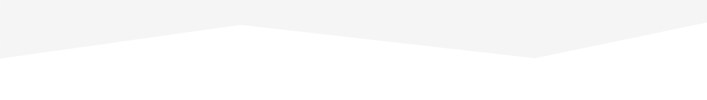

SET UP 
# FloodFiction
//  game for friends

npm init to make package folder

npm install express 

//  makes node_models folder which has all dependencies of express

npm install nedb ; this is for the db https://github.com/louischatriot/nedb

npm install -g nodemon // this will let the server rebuild ever time its updated

//  npm install jquery,popper, then bootstrap

https://developer.mozilla.org/en-US/docs/Web/API/Fetch_API/Using_Fetch 

//  https://expressjs.com/en/4x/api.html#express routing,getting,posting,etc.

npm install grunt --save-dev

npm install -g grunt-cli 

npm install grunt-bake --save-dev   // https://www.npmjs.com/package/grunt-bake/v/0.0.11

npm install grunt-contrib-watch --save-dev

// const db = monk('localhost/meower')
//  mlab to deploy mogodb
// now secret add mewower-db mogodb://<dbuser>:><dbpassword>@sdsadada.com:432/mewower

// deploy backend in zeit.co (now) 
//  now -e MONGO_URI=@meower-db
//  now alias https://server-xcbctndkeg.now.sh meower-api

//  front end deploy
//  cd to client --> now
//  now alias https://server-xcbctndkeg.now.sh meower
